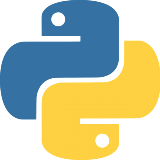
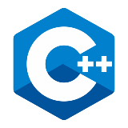
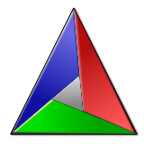
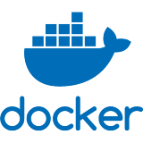

## Hello, I'm Ilya!
- I have experience and made projects with `Python` and `C`
- Currently I'm mastering `C`, `C++` and `backend development`
- I'm open for the internship / job opportunities as a `backend developer`
---

### Tools

---

### Contacts
- Languages: 🇷🇺 Russian (native), 🇺🇸 English (A2)
- TG: @S_A_Ilya
